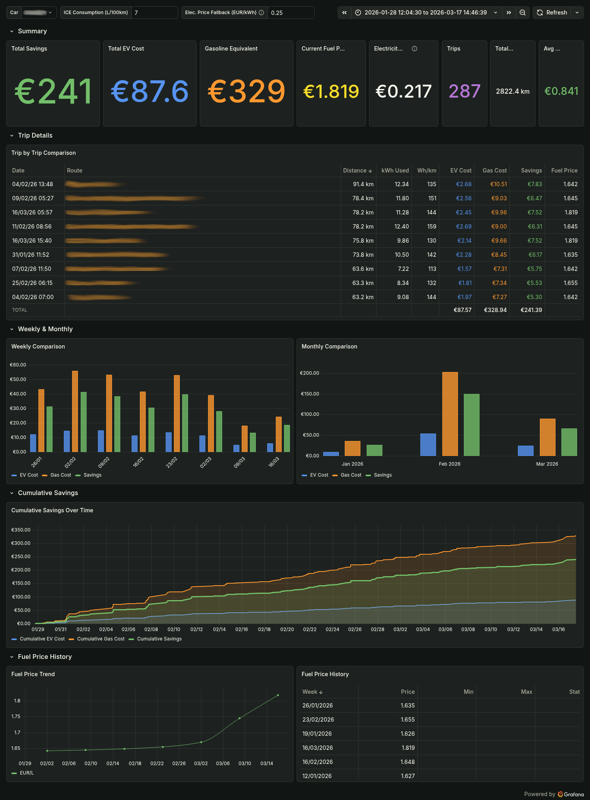

# TeslaMate EV vs Gasoline Savings

A Grafana custom dashboard for [TeslaMate](https://github.com/teslamate-org/teslamate) that shows how much you're actually saving with your Tesla compared to an ICE car, using **official weekly gasoline prices for Italy** from [MASE](https://sisen.mase.gov.it/).



---

## Features

* **Real MASE data:** Uses official weekly average gasoline prices from the Italian Ministry of Environment (SISEN). Fetches new data every Tuesday at 15:00 (configurable). On first start it also backfills historical prices (default from 01/01/2026).
* **Per-trip pricing:** Each trip is matched against the fuel price of that specific week.
* **Real charging costs:** Uses the weighted average from TeslaMate's actual charging data, with a configurable fallback price.
* **Detailed analytics:** Grafana dashboard with total savings, weekly/monthly trends, and per-trip breakdown.
* **Docker ready:** The price fetcher runs as a standalone Docker service.

## Setup

The fetcher container needs to be on the same Docker network as TeslaMate's PostgreSQL. **Back up your database before proceeding!**

### 1. Add the Docker service

Check the Docker network name used by TeslaMate. If it's not `teslamate_default`, update the `networks` section in `docker-compose.yml`:

```bash
docker network ls | grep teslamate
# edit docker-compose.yml and update the networks section accordingly
```

### 2. Configure .env and start the container

```bash
cp .env.example .env
# edit .env with your actual values
docker compose up -d --build
docker compose logs -f
```

The container will connect to the DB, create the schema, sync prices and show the schedule. If the DB connection fails, it retries for about 2 minutes before exiting with an error.

Then import the dashboard: *Grafana > Dashboards > Import >* upload `grafana/ev_savings_dashboard.json` > select the TeslaMate PostgreSQL datasource.

### 3. Environment variables

| Variable        | Default    | Description                                              |
|-----------------|------------|----------------------------------------------------------|
| `DB_HOST`       | database   | PostgreSQL hostname                                      |
| `DB_PORT`       | 5432       | PostgreSQL port                                          |
| `DB_NAME`       | teslamate  | TeslaMate database name                                  |
| `DB_USER`       | teslamate  | TeslaMate database user                                  |
| `DB_PASS`       | teslamate  | TeslaMate database password                              |
| `SYNC_ON_START` | true       | Backfill prices on container start                       |
| `SYNC_SINCE`    | 2026-01-01 | Oldest date to sync (empty = everything from 2005)       |
| `SCHEDULE_DAY`  | tuesday    | Day of the week for the scheduled fetch                  |
| `SCHEDULE_TIME` | 15:00      | Time of day for the scheduled fetch                      |

### 4. Grafana dashboard variables

| Variable                   | Default            | Notes                                                    |
|----------------------------|--------------------|----------------------------------------------------------|
| Car                        | first car in DB    | Which TeslaMate vehicle to analyze                       |
| ICE Consumption            | 7.0 L/100km        | Reference consumption for the gasoline car               |
| Electricity Price Fallback | 0.25 EUR/kWh       | Only used when TeslaMate has no charging cost data       |

### 5. Importing the dashboard

1. Open **Grafana**.
2. Go to **Dashboards** -> **New** -> **Import**.
3. Upload `ev_savings_dashboard.json`.
4. Select the TeslaMate datasource (PostgreSQL).

## Dashboard configuration

Once imported, you can adjust parameters from the top bar:

* **ICE Consumption:** Average consumption of the gasoline car you want to compare against (default: 7 L/100km).
* **Elec. Price Fallback:** Electricity price used when a charging session has no cost data.

## How the calculation works

There's no fixed average price. For each trip stored in the database:

1. Gets the kWh consumed from TeslaMate.
2. Calculates the electricity cost based on real charging data.
3. Looks up the gasoline price for that week to figure out what the same trip would have cost in an ICE car.
4. Computes the avoided fuel cost and shows the net savings.

---

## Disclaimer

*This dashboard only compares fuel costs. It does not account for maintenance, charging losses, taxes, insurance or depreciation.*

*Fuel price data is provided by the Italian Ministry of Environment and Energy Security (MASE) through the SISEN system.*

*This project is independent and not affiliated with Tesla, Inc. or the Ministry.*
