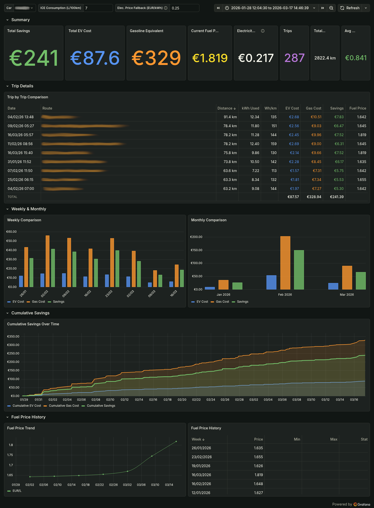

# TeslaMate EV vs Gasoline Savings

Questa dashboard custom di Grafana per [TeslaMate](https://github.com/teslamate-org/teslamate), permette di visualizzare il risparmio economico reale della Tesla rispetto a un'auto a combustione (ICE), utilizzando i **prezzi medi settimanali della benzina in Italia** forniti ufficialmente dal [MASE](https://sisen.mase.gov.it/).



---

## Caratteristiche principali

* **Dati Reali MASE:** Utilizza i prezzi medi settimanali della benzina in Italia forniti dal SISEN del Ministero, raccoglie i dati ogni martedì alle 15:00 (configurabile). Al primo avvio sincronizza anche i dati storici (default 01/01/2026).
* **Logica Dinamica:** Associa ad ogni viaggio il prezzo del carburante di quella specifica settimana.
* **Calcolo Costi Elettrici:** Utilizza i costi reali registrati su TeslaMate (media ponderata) con fallback configurabile.
* **Analisi Dettagliata:** Dashboard Grafana con risparmio totale, trend settimanali/mensili e dettaglio per singolo viaggio.
* **Docker Ready:** Il fetcher dei prezzi è integrato come servizio Docker.

## Installazione

Il docker del fetcher dei prezzi deve girare nella stessa rete del container di TeslaMate per accedere al database PostgreSQL. **Fare un backup del database prima di procedere!**

### 1. Aggiunta del servizio Docker

Controllare il nome della rete Docker usata da Teslamate, se è divesa da `teslamate_default` modificare di conseguenza il campo `networks` nel file `docker-compose.yml`:

```bash
docker network ls | grep teslamate
# editare docker-compose.yaml e modificare la sezione networks di conseguenza.
```

### 2. Personalizzare il file .env e far partire il container

Aggiungere le variabili d'ambiente per la connessione al database di TeslaMate nel file `.env`:

```bash
cp .env.example .env
# edita .env con i dati corretti
docker compose up -d --build
docker compose logs -f
```

Il container dovrebbe connettersi al DB, creare lo schema, sincronizzare i prezzi e visualizzare lo schedule. Se la connessione al DB fallisce, il programma riprova per circa 2 minuti prima di terminare con errore.

Importa la dashboard in Grafana: *Grafana > Dashboards > Import > carica* `grafana/ev_savings_dashboard.json` > selezionare il datasource PostgreSQL di TeslaMate.

### 3. variabili del file .env

| Variable          | Default    | Description                                           |
| ----------------- | ---------- | ----------------------------------------------------- |
| `DB_HOST`       | database   | Hostname del DB PostgreSQL                            |
| `DB_PORT`       | 5432       | Porta del DB PostgreSQL                               |
| `DB_NAME`       | teslamate  | Nome del DB TeslaMate                                 |
| `DB_USER`       | teslamate  | Utente del DB TeslaMate                               |
| `DB_PASS`       | teslamate  | Password del DB TeslaMate                             |
| `SYNC_ON_START` | true       | Sincronizzazione iniziale all'avvio del container     |
| `SYNC_SINCE`    | 2026-01-01 | Data più vecchia da sincronizzare (vuoto = dal 2005) |
| `SCHEDULE_DAY`  | tuesday    | Giorno  per la sincronizzazione                       |
| `SCHEDULE_TIME` | 15:00      | Ora del giorno per la sincronizzazione                |

### 4. Variabili dashboard Grafana

| Variable                   | Default           | Notes                                                     |
| -------------------------- | ----------------- | --------------------------------------------------------- |
| Car                        | prima auto del DB | Quale veicolo TeslaMate analizzare                        |
| ICE Consumption            | 7.0 L/100km       | Consumo di riferimento del veicolo a benzina              |
| Electricity Price Fallback | 0.25 EUR/kWh      | Usato solo se TeslaMate non ha dati sui costi di ricarica |

### 5. Importazione della Dashboard

1. Aprire**Grafana**.
2. Andare su**Dashboards** ->**New** ->**Import**.
3. Caricare il file`ev_savings_dashboard.json`.
4. Selezionare il data source di TeslaMate (PostgreSQL).

## Configurazione Dashboard

Una volta importata, si possono regolare i parametri tramite i campi in alto:

* **ICE Consumption:** Consumo medio dell'auto a benzina si vuole confrontare (default: 7L/100km).
* **Elec. Price Fallback:** Prezzo dell'elettricità se i dati di una ricarica sono NULL.

## Come funziona la logica

Il sistema non usa una media fissa. Per ogni viaggio salvato nel database:

1. Recupera i kWh consumati da Teslamate.
2. Calcola il costo elettrico medio basandosi sulle ricariche reali.
3. Usa il prezzo della benzina della settimana corrente per calcolare quanto sarebbe costato fare lo stesso viaggio con un'auto a benzina.
4. Calcola il costo "evitato" della benzina e genera il risparmio netto.

---

## Disclaimer

*La dashboard non tiene conto di altri fattori come manutenzione, perdite di carica, tasse, assicurazione o svalutazione, ma confronta solamente i costi di carburante.*

*I dati sui prezzi del carburante sono forniti dal Ministero dell'Ambiente e della Sicurezza Energetica (MASE) tramite il sistema SISEN.*

*Questo progetto è indipendente e non affiliato con Tesla, Inc. o con il Ministero.*
